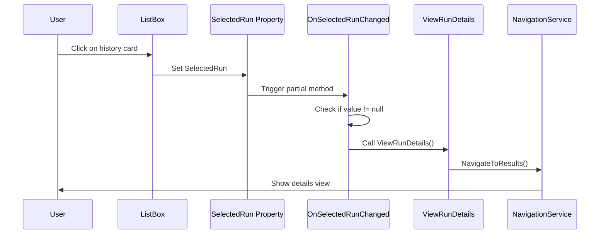

# Fix History Card Click Handling

## Problem

Users must click multiple times on a history card to open test details. The click doesn't register reliably.

## Root Cause

The current implementation uses `MouseBinding` with `MouseAction="LeftClick"` on the Border:

```xml
<Border Style="{StaticResource Card}" ...>
    <Border.InputBindings>
        <MouseBinding MouseAction="LeftClick"
                    Command="{Binding DataContext.ViewRunDetailsCommand, ...}"/>
    </Border.InputBindings>
    ...
</Border>
```

This approach is unreliable because:
1. **Child elements consume clicks** - TextBlocks, StackPanels, and inner Borders inside the card intercept mouse events before they reach the parent Border's InputBindings
2. **Delete button intercepts clicks** - Clicks near the delete button area go to the button instead
3. **ListBox selection conflict** - The ListBox tries to select the item while MouseBinding tries to execute a command, causing race conditions

## Solution

Auto-navigate when selection changes - Remove the `MouseBinding` and trigger navigation automatically when the ListBox selection changes.

This is a standard WPF pattern: single click selects the item, and selection change triggers the action.

## Implementation Plan

### Files to Modify

| File | Changes |
|------|---------|
| `src/ReqChecker.App/Views/HistoryView.xaml` | Remove MouseBinding from card Border |
| `src/ReqChecker.App/ViewModels/HistoryViewModel.cs` | Navigate in OnSelectedRunChanged |

### Step 1: Update HistoryViewModel.cs

Modify `OnSelectedRunChanged` to auto-navigate when a run is selected:

```csharp
partial void OnSelectedRunChanged(RunReport? value)
{
    OnPropertyChanged(nameof(HasSelectedRun));
    if (value != null)
    {
        ViewRunDetails();
    }
}
```

**Location:** [`HistoryViewModel.cs`](src/ReqChecker.App/ViewModels/HistoryViewModel.cs:204-207)

### Step 2: Update HistoryView.xaml

Remove the `<Border.InputBindings>` section from the card template (lines 270-273):

```xml
<!-- DELETE THESE LINES -->
<Border.InputBindings>
    <MouseBinding MouseAction="LeftClick"
                Command="{Binding DataContext.ViewRunDetailsCommand, RelativeSource={RelativeSource AncestorType=Page}}"/>
</Border.InputBindings>
```

**Location:** [`HistoryView.xaml`](src/ReqChecker.App/Views/HistoryView.xaml:270-273)

## Verification

1. **Build:** `dotnet build src/ReqChecker.App`
2. **Run app** and navigate to Test History
3. **Verify:** Single click on any history card immediately opens the details view
4. **Verify:** Delete button still works (doesn't trigger navigation)

## Technical Details

### Why This Works Better

The ListBox's `SelectedItem` binding is two-way and handles selection events reliably. When a user clicks anywhere on the ListBoxItem (including on child elements), the ListBox properly updates the `SelectedRun` property, which triggers `OnSelectedRunChanged`.

### Delete Button Behavior

The delete button uses a `Command` binding directly, which will execute before the selection change event. The delete command removes the item from the collection, so by the time `OnSelectedRunChanged` fires, the item is already gone and `SelectedRun` will be null (or a different item), preventing navigation.

### Mermaid Diagram: Event Flow



## Related Specifications

- **Spec 023**: Test History - SC-003: "Users can determine if a test is flaky within 3 clicks from the history view"
- The current implementation violates this spec due to unreliable click handling
