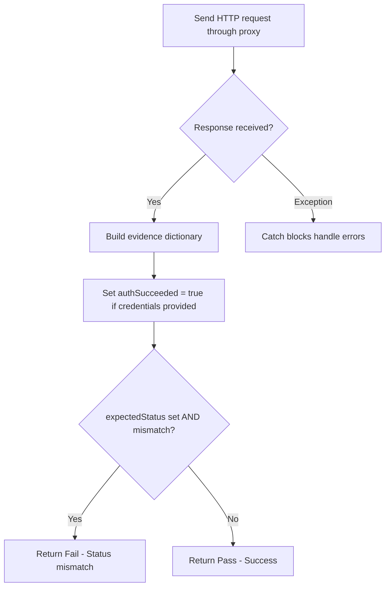
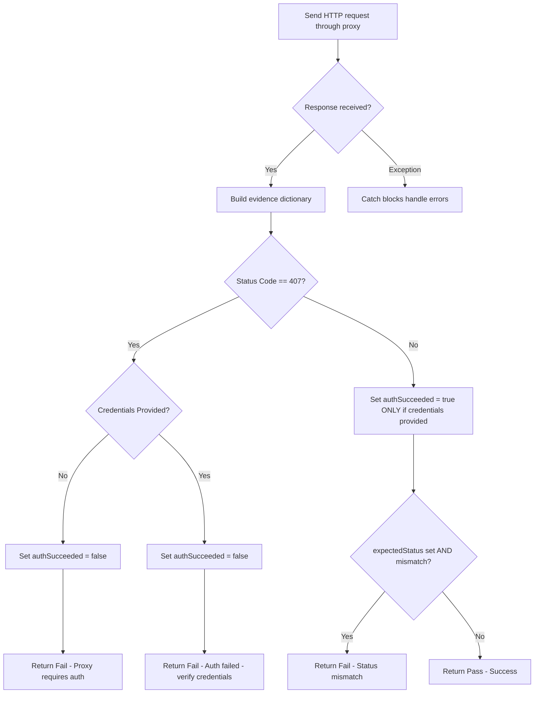

# Fix Plan: Treat Proxy Auth Responses as Failures

## Issue Summary

**Review Comment (P1)**: The ProxyConnectivityTest only fails when `expectedStatus` is set; otherwise any HTTP response is treated as success. If a proxy requires authentication, HttpClient typically returns a 407 response (not an exception), so the code marks the test as Pass and sets `authSucceeded = true` when credentials are missing or wrong.

## Problem Analysis

### Current Code Flow (Lines 74-126)



### Root Cause

1. **Line 93**: `authSucceeded = true` is set unconditionally when credentials are provided, without verifying authentication actually succeeded

2. **Lines 96-115**: Only checks for `expectedStatus` mismatch - does NOT check for 407 status

3. **Lines 117-126**: Any response that doesn't have an `expectedStatus` mismatch is treated as Pass

4. **Lines 167-186**: The 407 handling in the catch block only catches `HttpRequestException`, but `HttpClient.SendAsync()` returns a 407 `HttpResponseMessage` - it does NOT throw an exception

### Impact

- A proxy returning 407 (Proxy Authentication Required) will be reported as **Pass**
- `authSucceeded` will be set to **true** even when authentication failed
- Users will not be notified of missing or incorrect proxy credentials

## Proposed Fix

### New Code Flow



### Code Changes Required

**File**: `src/ReqChecker.Infrastructure/Tests/ProxyConnectivityTest.cs`

**Location**: After line 94 (after building the evidence dictionary, before the expectedStatus check)

**Changes**:

1. Add a check for `HttpStatusCode.ProxyAuthenticationRequired` (407) BEFORE the `expectedStatus` check

2. Move the `authSucceeded = true` assignment to AFTER confirming the response is NOT 407

3. Handle two cases for 407:
   - No credentials provided: "Proxy requires authentication — provide proxyUsername and proxyPassword parameters"
   - Credentials provided: "Proxy authentication failed — verify credentials"

### Specific Code Modification

Replace lines 89-115 with:

```csharp
// Check for proxy authentication required (407) - T009
// HttpClient returns 407 as a response, not an exception
if (response.StatusCode == HttpStatusCode.ProxyAuthenticationRequired)
{
    stopwatch.Stop();
    result.EndTime = DateTime.UtcNow;
    result.Duration = stopwatch.Elapsed;
    result.Status = TestStatus.Fail;

    string errorMessage;
    if (string.IsNullOrEmpty(parameters.ProxyUsername))
    {
        errorMessage = "Proxy requires authentication — provide proxyUsername and proxyPassword parameters";
        evidence["authSucceeded"] = false;
    }
    else
    {
        errorMessage = "Proxy authentication failed — verify credentials";
        evidence["authSucceeded"] = false;
        evidence["proxyUsername"] = parameters.ProxyUsername;
    }

    result.HumanSummary = errorMessage;
    result.Error = new TestError
    {
        Category = ErrorCategory.Permission,
        Message = errorMessage
    };
    result.Evidence = new TestEvidence
    {
        ResponseData = JsonSerializer.Serialize(evidence)
    };
    return result;
}

// Add authentication evidence if credentials were provided (T009)
// Only set authSucceeded = true if we didn't get a 407 response
if (!string.IsNullOrEmpty(parameters.ProxyUsername))
{
    evidence["proxyUsername"] = parameters.ProxyUsername;
    evidence["authSucceeded"] = true;
}

// Check for expected status (T004)
var statusCode = (int)response.StatusCode;
if (parameters.ExpectedStatus.HasValue && statusCode != parameters.ExpectedStatus.Value)
{
    stopwatch.Stop();
    result.EndTime = DateTime.UtcNow;
    result.Duration = stopwatch.Elapsed;
    result.Status = TestStatus.Fail;
    result.HumanSummary = $"Status mismatch: expected {parameters.ExpectedStatus.Value}, got {statusCode}";
    result.Error = new TestError
    {
        Category = ErrorCategory.Validation,
        Message = result.HumanSummary
    };
    result.Evidence = new TestEvidence
    {
        ResponseData = JsonSerializer.Serialize(evidence)
    };
    return result;
}
```

## Testing Considerations

After the fix:
1. A 407 response without credentials → Fail with "Proxy requires authentication" message
2. A 407 response with wrong credentials → Fail with "Proxy authentication failed" message
3. A 200 response with correct credentials → Pass with `authSucceeded = true`
4. A 200 response without credentials → Pass (no auth needed)

## Validation

The fix aligns with the spec requirement from T009:
> "detect HTTP 407 (Proxy Authentication Required) responses and set `authSucceeded = false` with error message"

The current code only handles 407 in the exception handler, but HttpClient doesn't throw for 407 - it returns a response. This fix adds the missing response-based 407 handling.
