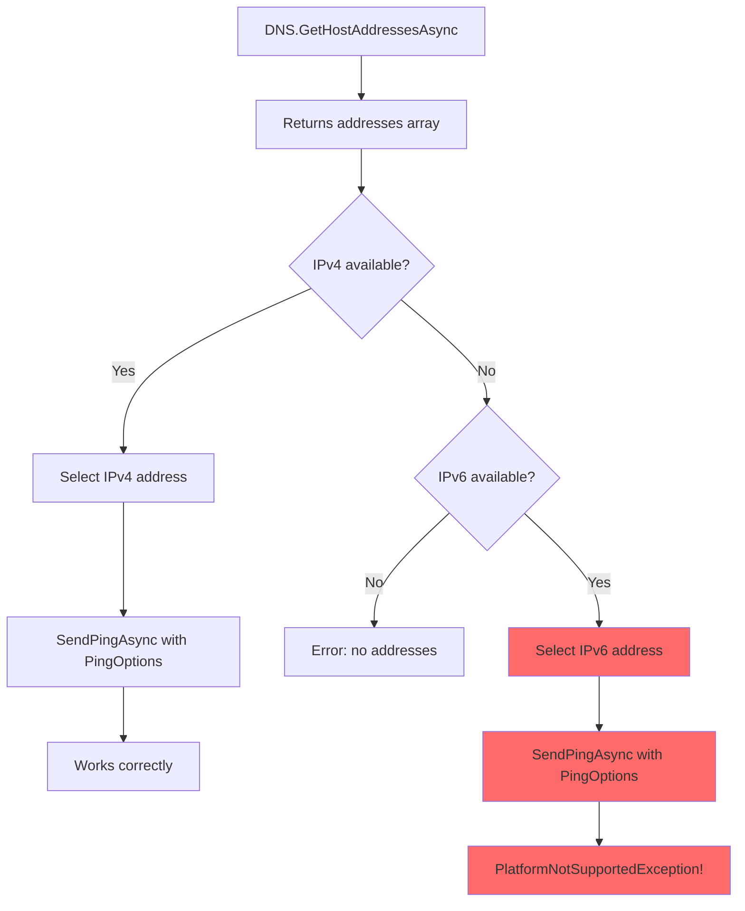

# Fix Plan: Traceroute IPv6/IPv4 Handling Issue

## Problem Statement

**Review Comment (P2):** When a hostname resolves to IPv6 only (or the user supplies an IPv6 literal), `SendPingAsync(targetAddress, ..., options)` will throw a `PlatformNotSupportedException` because `PingOptions` is only supported for IPv4.

**Location:** [`TracerouteTest.cs:71-100`](src/ReqChecker.Infrastructure/Tests/TracerouteTest.cs:71-100)

## Current State

The code already has a partial fix that prefers IPv4 addresses:

```csharp
// Lines 71-74
var targetAddress = addresses.FirstOrDefault(a => a.AddressFamily == AddressFamily.InterNetwork)
    ?? addresses.FirstOrDefault(a => a.AddressFamily == AddressFamily.InterNetworkV6);
```

**However**, when only IPv6 is available (the fallback case), the code still proceeds to use `PingOptions` which will throw `PlatformNotSupportedException` during the ping loop.

## Root Cause Analysis



The issue occurs because:

1. `PingOptions` class in .NET only supports IPv4 addresses
2. The current code falls back to IPv6 when no IPv4 is available
3. When IPv6 is selected, the ping loop will fail with `PlatformNotSupportedException`

## Proposed Solution

**Strategy:** Explicitly reject IPv6-only targets with a clear error message before attempting the ping loop.

### Code Changes

Update lines 71-81 in [`TracerouteTest.cs`](src/ReqChecker.Infrastructure/Tests/TracerouteTest.cs:71-81):

**Current Code:**
```csharp
// Prefer IPv4 address since PingOptions only supports IPv4
// This prevents PlatformNotSupportedException when IPv6 is returned first
var targetAddress = addresses.FirstOrDefault(a => a.AddressFamily == AddressFamily.InterNetwork)
    ?? addresses.FirstOrDefault(a => a.AddressFamily == AddressFamily.InterNetworkV6);

if (targetAddress == null)
{
    throw new InvalidOperationException($"DNS resolution returned no usable IP addresses for host '{host}'");
}

resolvedIp = targetAddress.ToString();
```

**Updated Code:**
```csharp
// Prefer IPv4 address since PingOptions only supports IPv4
// This prevents PlatformNotSupportedException when IPv6 is returned first
var targetAddress = addresses.FirstOrDefault(a => a.AddressFamily == AddressFamily.InterNetwork);

if (targetAddress == null)
{
    // No IPv4 address available - check if IPv6 exists
    var ipv6Address = addresses.FirstOrDefault(a => a.AddressFamily == AddressFamily.InterNetworkV6);
    if (ipv6Address != null)
    {
        throw new InvalidOperationException(
            $"Host '{host}' only has IPv6 addresses. Traceroute is not supported for IPv6 targets " +
            "because .NET PingOptions does not support IPv6. Please use an IPv4 address or a host with IPv4 support.");
    }
    
    throw new InvalidOperationException($"DNS resolution returned no usable IP addresses for host '{host}'");
}

resolvedIp = targetAddress.ToString();
```

### Behavior Matrix

| Scenario | Addresses Returned | Selected Address | Result |
|----------|-------------------|------------------|--------|
| IPv4 only | 192.168.1.1 | 192.168.1.1 | ✅ Works |
| IPv6 only | 2001:db8::1 | None | ✅ Clear error message |
| Dual-stack (IPv6 first) | 2001:db8::1, 192.168.1.1 | 192.168.1.1 | ✅ Works |
| Dual-stack (IPv4 first) | 192.168.1.1, 2001:db8::1 | 192.168.1.1 | ✅ Works |
| No addresses | (empty) | None | ✅ Clear error message |

### Alternative Approaches Considered

1. **Separate IPv6 path without PingOptions** - More complex, would require different traceroute mechanism for IPv6 using raw sockets
2. **Try-catch with fallback** - Catches exception but provides less clear error message
3. **Configuration option** - Overkill for this use case

The explicit rejection approach is the simplest and most user-friendly solution.

## Implementation Checklist

- [x] Add `using System.Net.Sockets;` (already present)
- [ ] Update address selection logic to explicitly reject IPv6-only targets
- [ ] Add clear error message explaining the limitation
- [ ] Verify the error is properly caught and returned in TestResult

## Testing Recommendations

1. Test with IPv4-only hostname (e.g., `127.0.0.1`)
2. Test with dual-stack hostname (e.g., `google.com`)
3. Test with IPv6-only hostname (should fail with clear error about IPv6 not supported)
4. Test with IPv6 literal input (e.g., `::1` - should fail with clear error)
